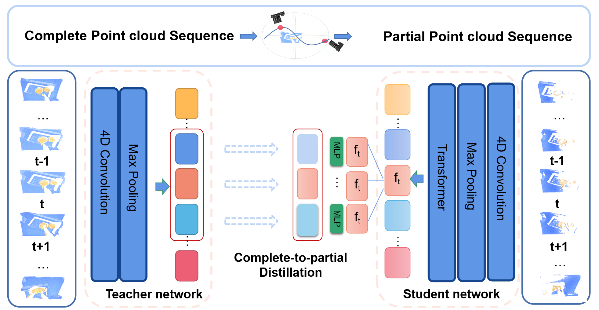

## Complete-to-Partial 4D Distillation for Self-Supervised Point Cloud Sequence Representation Learning

This repository contains the PyTorch implementation of our paper:

[Complete-to-Partial 4D Distillation for Self-Supervised Point Cloud Sequence Representation Learning](https://arxiv.org/pdf/2212.05330.pdf), *Zhuoyang Zhang\*, Yuhao Dong\*, Yunze Liu, Li Yi*, CVPR2023.

### Introduction

Recent work on 4D point cloud sequences has attracted a lot of attention. However, obtaining exhaustively labeled 4D datasets is often very expensive and laborious, so it is especially important to investigate how to utilize raw unlabeled data. However, most existing self-supervised point cloud representation learning methods only consider geometry from a static snapshot omitting the fact that sequential observations of dynamic scenes could reveal more comprehensive geometric details. And the video representation learning frameworks mostly model motion as image space flows, let alone being 3D-geometric-aware. To overcome such issues, this paper proposes a new 4D self-supervised pre-training method called Complete-to-Partial 4D Distillation. Our key idea is to formulate 4D self-supervised representation learning as a teacher-student knowledge distillation framework and let the student learn useful 4D representations with the guidance of the teacher. Experiments show that this approach significantly outperforms previous pre-training approaches on a wide range of 4D point cloud sequence understanding tasks including indoor and outdoor scenarios.



### Links

- [Project Page (Still ongoing) ](https://github.com/dongyh20/c2p.github.io)

- [arXiv Page](https://arxiv.org/abs/2212.05330)

### Environment and package dependency

The main experiments are implemented on PyTorch 1.9.0, Python 3.6.13, CUDA 11.6.

Compile the CUDA layers for [PointNet++](http://arxiv.org/abs/1706.02413), which we used for furthest point sampling (FPS) and radius neighbouring search:

```
mv modules-pytorch-1.4.0/modules-pytorch-1.8.1 modules
cd modules
python setup.py install
```

### Data

To get the raw data of HOI4D, please refer to this [page](https://hoi4d.github.io/). To get the specific data for Action Segmentation and Semantic Segmentation tasks, please refer to this [page](http://www.hoi4d.top/#downLoad) .

For pretrain data for Action Segmentation task on HOI4D dataset, download from [here](https://drive.google.com/drive/folders/1ITMKsmDr9QU9-_1ohDbwrGU8ZxNHHWWy?usp=sharing).

To generate pretrain data for other tasks, please use this command:

```

```

### Citation

If you find our work useful in your research, please consider citing:

```
@article{dong2022complete,
  title={Complete-to-Partial 4D Distillation for Self-Supervised Point Cloud Sequence RepresentationLearning},
  author={Dong, Yuhao and Zhang, Zhuoyang and Liu, Yunze and Yi, Li},
  journal={arXiv preprint arXiv:2212.05330},
  year={2022}
}
```

### Related Repos

1. PointNet++ PyTorch implementation: https://github.com/facebookresearch/votenet/tree/master/pointnet2
2. Transformer: https://github.com/lucidrains/vit-pytorch
3. HOI4D: [https://github.com/leolyliu/HOI4D-Instructions](https://github.com/leolyliu/HOI4D-Instructions)
4. P4Transformer: [https://github.com/hehefan/P4Transformer](https://github.com/hehefan/P4Transformer)
5. PPTr: [https://github.com/hoi4d/PPTr](https://github.com/hoi4d/PPTr)

### Acknowledgement

We thank the authors of [P4transformer](https://github.com/hehefan/P4Transformer) and [PPTr](https://github.com/hoi4d/PPTr) for their interesting work.
